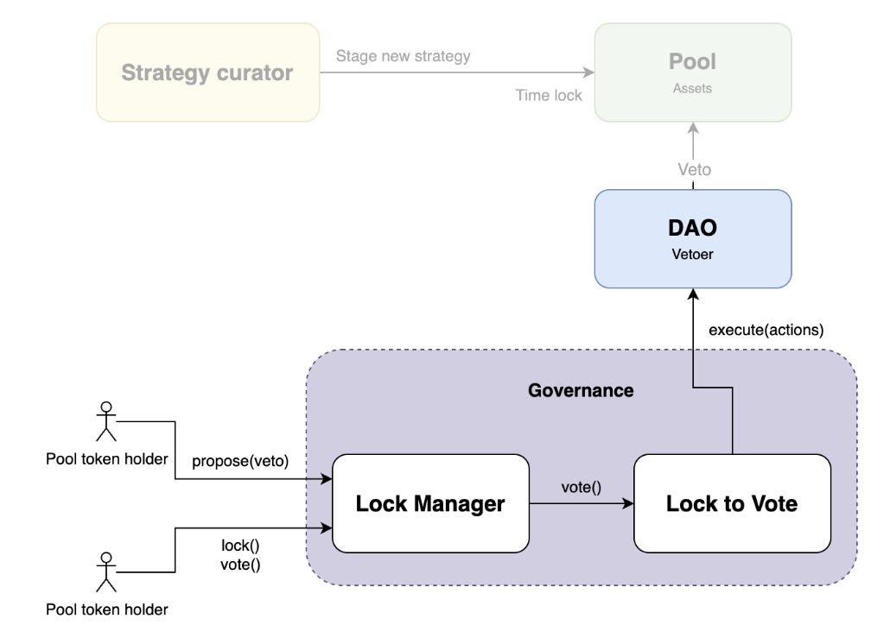

# Lock to Vote Plugin

[](https://book.getfoundry.sh/)

**An OSx governance plugin, enabling immediate voting through token locking**

Built on Aragon OSx's modular framework, LockToVote bypasses the need for *ahead of time* token snapshots via IVotes compatible tokens. **All ERC20 contracts** can now be used to participate in DAO governance.

See the [ERC20 token checklist](#erc20-token-checklist) below.

## Audit

The [source code of LockToVote](https://github.com/aragon/lock-to-vote-plugin/releases/tag/spearbit-review-end-2508) has been [audited by Spearbit](./audit/report-cantinacode-aragon-0729.pdf) between July and August 2025.

## Overview



`LockToVote` is a versatile majority voting plugin with configurable modes:

- **Multi-option voting**: Vote Yes/No/Abstain
- **Two voting modes**:
  - **Vote Replacement**: Update your vote option mid-proposal
  - **Standard Mode**: Traditional voting with append-only allocations
- **Customizable thresholds**: Minimum participation, support threshold, and a certain approval tally

## Architecture Overview

### Core Components

#### LockManager

The custodial contract managing token locks and allowing to vote in multiple proposals with a single lock

- `LockManagerBase` contains the common logic, while `LockManagerERC20` includes the specific implementation to manage ERC20 token locks.
- `lock()` deposits the available ERC20 allowance into the contract and updates the cumulative locked balance. If the balance is lower than the allowance, the whole balance is locked.
- `lock(amount)` deposits the requested ERC20 amount into the contract and updates the cumulative locked balance.
- `vote()` calls `lockToVote.vote()` with the currently locked balance on behalf of the user
- Locking and voting can be done at once with `lockAndVote()`
- To prevent unlocking with votes on active proposals, it keeps track of them via the `proposalCreated()` and `proposalSettled()` hooks

#### LockToVote

Governance plugin where successful proposals can be executed on the DAO

- Handles `IMajorityVoting.VoteOption` votes (Yes/No/Abstain)
- `vote()` allocates the current voting power into the selected voite option
- `clearVote()`: Depending on the voting mode, revoke the current allocation and trigger the corresponding tally updates
- `execute()` makes the DAO execute the given (successful) proposal's actions

### Proposal Lifecycle

```solidity
// Allow the LockManager to take our tokens
token.approve(address(lockManager), 0.1 ether);

// Lock the available tokens and vote immediately
lockManager.lockAndVote(proposalId, VoteOption.Yes);

// Or lock first, vote later
token.approve(address(lockManager), 0.5 ether);
lockManager.lock();
lockManager.vote(proposalId, VoteOption.Abstain);

// Deposit more tokens and vote with the new balance
token.approve(address(lockManager), 5 ether);
lockManager.lockAndVote(proposalId, VoteOption.No);

// Unlock your tokens (if the plugin voting mode allows it)
lockManager.unlock();
```

### Token unlocking

Users can unlock their tokens as long as `LockToVote` allows it. For this:

- Either, the plugin `votingMode` is `VoteReplacement`, or
- The token holder has no votes allocated to any active proposal

Otherwise, the `unlock()` will revert until the proposals with votes have ended.

## Get Started

To get started, ensure that [Foundry](https://getfoundry.sh/) and [Make](https://www.gnu.org/software/make/) are installed on your computer.

### Using the Makefile

The `Makefile` is the target launcher of the project. It's the recommended way to work with it. It manages the env variables of common tasks and executes only the steps that need to be run.

```
$ make
Available targets:

- make init       Check the dependencies and prompt to install if needed
- make clean      Clean the build artifacts

- make test            Run unit tests, locally
- make test-coverage   Generate an HTML coverage report under ./report

- make sync-tests       Scaffold or sync tree files into solidity tests
- make check-tests      Checks if solidity files are out of sync
- make markdown-tests   Generates a markdown file with the test definitions rendered as a tree

- make pre-deploy-testnet        Simulate a deployment to the testnet
- make pre-deploy-prodnet        Simulate a deployment to the production network

- make deploy-testnet        Deploy to the testnet and verify
- make deploy-prodnet        Deploy to the production network and verify

- make refund   Refund the remaining balance left on the deployment account
```

Run `make init`:
- It ensures that Foundry is installed
- It runs a first compilation of the project
- It copies `.env.example` into `.env`

Next, customize the values of `.env`.

### Understanding `.env.example`

The env.example file contains descriptions for all the initial settings. You don't need all of these right away but should review prior to fork tests and deployments

### Deployment Checklist

- [ ] I have cloned the official repository on my computer and I have checked out the corresponding branch
- [ ] I am using the latest official docker engine, running a Debian Linux (stable) image
  - [ ] I have run `docker run --rm -it -v .:/deployment debian:bookworm-slim`
  - [ ] I have run `apt update && apt install -y make curl git vim neovim bc`
  - [ ] I have run `curl -L https://foundry.paradigm.xyz | bash`
  - [ ] I have run `source /root/.bashrc && foundryup`
  - [ ] I have run `cd /deployment`
  - [ ] I have run `make init`
  - [ ] I have printed the contents of `.env` on the screen
- [ ] I am opening an editor on the `/deployment` folder, within the Docker container
- [ ] The `.env` file contains the correct parameters for the deployment
  - [ ] I have created a brand new burner wallet with `cast wallet new` and copied the private key to `DEPLOYMENT_PRIVATE_KEY` within `.env`
  - [ ] I have reviewed the target network and RPC URL
  - The plugin ENS subdomain
    - [ ] Contains a meaningful and unique value
  - The given OSx addresses:
    - [ ] Exist on the target network
    - [ ] Contain the latest stable official version of the OSx DAO implementation, the Plugin Setup Processor and the Plugin Repo Factory
    - [ ] I have verified the values on https://www.npmjs.com/package/@aragon/osx-commons-configs?activeTab=code > `/@aragon/osx-commons-configs/dist/deployments/json/`
- [ ] All the unit tests pass (`make test`)
- **Target test network**
  - [ ] I have run a preview deployment on the testnet
    - `make pre-deploy-testnet`
  - [ ] I have deployed my contracts successfully to the target testnet
    - `make deploy-testnet`
  - [ ] I have tested that these contracts work successfully
- [ ] My deployment wallet is a newly created account, ready for safe production deploys.
- My computer:
  - [ ] Is running in a safe physical location and a trusted network
  - [ ] It exposes no services or ports
  - [ ] The wifi or wired network used does does not have open ports to a WAN
- [ ] I have previewed my deploy without any errors
  - `make pre-deploy-prodnet`
- [ ] The deployment wallet has sufficient native token for gas
  - At least, 15% more than the estimated simulation
- [ ] Unit tests still run clean
- [ ] I have run `git status` and it reports no local changes
- [ ] The current local git branch (`main`) corresponds to its counterpart on `origin`
  - [ ] I confirm that the rest of members of the ceremony pulled the last commit of my branch and reported the same commit hash as my output for `git log -n 1`
- [ ] I have initiated the production deployment with `make deploy-prodnet`

### Post deployment checklist

- [ ] The deployment process completed with no errors
- [ ] The deployed factory was deployed by the deployment address
- [ ] The reported contracts have been created created by the newly deployed factory
- [ ] The smart contracts are correctly verified on Etherscan or the corresponding block explorer
- [ ] The output of the latest `deployment-*.log` file corresponds to the console output
- [ ] I have transferred the remaining funds of the deployment wallet to the address that originally funded it
  - `make refund`

### ERC20 token checklist

When configuring the plugin deployment, make sure to check the implementation of your token contract.

- **Only ERC20s**: The LockManager only deals with underlying tokens of ERC-20 compatible standards. Other fungible token standards such as ERC-1155, are not supported.
- **Double-entry-point tokens**, i.e. tokens that share the same tracking of balances but have two separate contract addresses from which these balances can be controlled. They should be usable without any issue.
- **Non-reverting tokens**: ERC-20 Tokens historically handle errors in two possible ways, they either revert on errors or they simply return `false` as a result. The plugin uses SafeERC20, which ensures that non reverting tokens do revert given in case of an insufficient balance.
- **ERC20s lacking `decimals()`**: Within the ERC-20 standard, the existence of a `decimals()` function is optional. The plugin has no need for this function's existence and supports tokens without it.
- **Tokens with callbacks**: There exist various standard extensions such as ERC-223, ERC-677, ERC-777, etc., as well as custom ERC-20 compatible token implementations that call the sender, receiver, or both, during a token transfer. Furthermore, such implementations may choose to call before or after the token balances were updated. This is especially dangerous since it may allow re-entering the protocol and exploit incomplete state updates. Such tokens can be used safely.
- **Tokens with strict allowance handling**: There are tokens that revert when attempting to change an existing token allowance from a non-zero value to another non-zero value. The plugin makes no calls to the token's `approve()` function and should have no issue in using them.
- **Non-standard decimals**: Tokens typically have 18 decimals, but some deviate from this, usually towards lower numbers. The plugin supports tokens that have large deviations from the typical 18 decimals. It is only for extremely large decimal numbers (>50), combined with large transfer amounts, that there may be problems due to the `10^6` scaling used.
- **Care required for Tokens with variable supply**: The plugin relies on the Total Token Supply to be relatively stable in order to determine the total existing voting power and use it for threshold checks. Tokens that have burn and mint functionality, or other ways allowing to affect the total supply, should be integrated with care.

Not supported:

- **NOT supported: Deflationary, Inflationary or Rebasing Tokens**: There are tokens (such as Aave's aToken) which increase in balance over time, or decrease in balance over time (various algorithmic stable coins), this may cause accounting issues within smart contracts holding them. When a user adds funds to the plugin, the plugin assumes that the sum of balances stays equal to the current balance held by the plugin.
  - If the balance increases, the surplus is attributed to the LockManager. Not the original token holders.
  - If the balance decreases, those who withdraw (call `unlock()`) first will obtain their full balance, but not all users will be able to withdraw once funds have run out.
- **NOT supported: Tokens with Transfer Fees**: There are tokens which may charge a fee for transfers. This fee could be applied on the value being sent, decreasing the amount reaching the receiver, or it could be applied on the sender's remaining balance. The plugin assumes that the value specified as amount during the transfer is exactly that value that actually arrived at the plugin, unless the transfer reverts. It does currently not handle the case where the received balance deviates from the requested amount.

### Manual deployment (CLI)

You can of course run all commands from the command line:

```sh
# Load the env vars
source .env
```

```sh
# run unit tests
forge test --no-match-path "test/fork/**/*.sol"
```

```sh
# Set the right RPC URL
RPC_URL="https://eth-sepolia.g.alchemy.com/v2/${ALCHEMY_API_KEY}"
```

```sh
# Run the deployment script

# If using Etherscan
forge script --chain "$NETWORK" script/Deploy.s.sol:Deploy --rpc-url "$RPC_URL" --broadcast --verify

# If using BlockScout
forge script --chain "$NETWORK" script/Deploy.s.sol:Deploy --rpc-url "$RPC_URL" --broadcast --verify --verifier blockscout --verifier-url "https://sepolia.explorer.mode.network/api\?"
```

If you get the error Failed to get EIP-1559 fees, add `--legacy` to the command:

```sh
forge script --chain "$NETWORK" script/Deploy.s.sol:Deploy --rpc-url "$RPC_URL" --broadcast --verify --legacy
```

If some contracts fail to verify on Etherscan, retry with this command:

```sh
forge script --chain "$NETWORK" script/Deploy.s.sol:Deploy --rpc-url "$RPC_URL" --verify --legacy --private-key "$DEPLOYMENT_PRIVATE_KEY" --resume
```

## Testing

See the [test tree](./TEST_TREE.md) file for a visual representation of the implemented tests.

Tests can be described using yaml files. They will be automatically transformed into solidity test files with [bulloak](https://github.com/alexfertel/bulloak).

Create a file with `.t.yaml` extension within the `test` folder and describe a hierarchy of test cases:

```yaml
# MyPluginTest.t.yaml

MyPluginTest:
- given: proposal exists
  comment: Comment here
  and:
  - given: proposal is in the last stage
    and:

    - when: proposal can advance
      then:
      - it: Should return true

    - when: proposal cannot advance
      then:
      - it: Should return false

  - when: proposal is not in the last stage
    then:
    - it: should do A
      comment: This is an important remark
    - it: should do B
    - it: should do C

- when: proposal doesn't exist
  comment: Testing edge cases here
  then:
  - it: should revert
```

Then use `make` to automatically sync the described branches into solidity test files.

```sh
$ make
Available targets:
# ...
- make sync-tests       Scaffold or sync tree files into solidity tests
- make check-tests      Checks if solidity files are out of sync
- make markdown-tests   Generates a markdown file with the test definitions rendered as a tree

$ make sync-tests
```

The final output will look like a human readable tree:

```
# MyPluginTest.tree

MyPluginTest
├── Given proposal exists // Comment here
│   ├── Given proposal is in the last stage
│   │   ├── When proposal can advance
│   │   │   └── It Should return true
│   │   └── When proposal cannot advance
│   │       └── It Should return false
│   └── When proposal is not in the last stage
│       ├── It should do A // Careful here
│       ├── It should do B
│       └── It should do C
└── When proposal doesn't exist // Testing edge cases here
    └── It should revert
```

And the given tree file will be used by bulloak to produce test file templates where tests can be addeed to.
