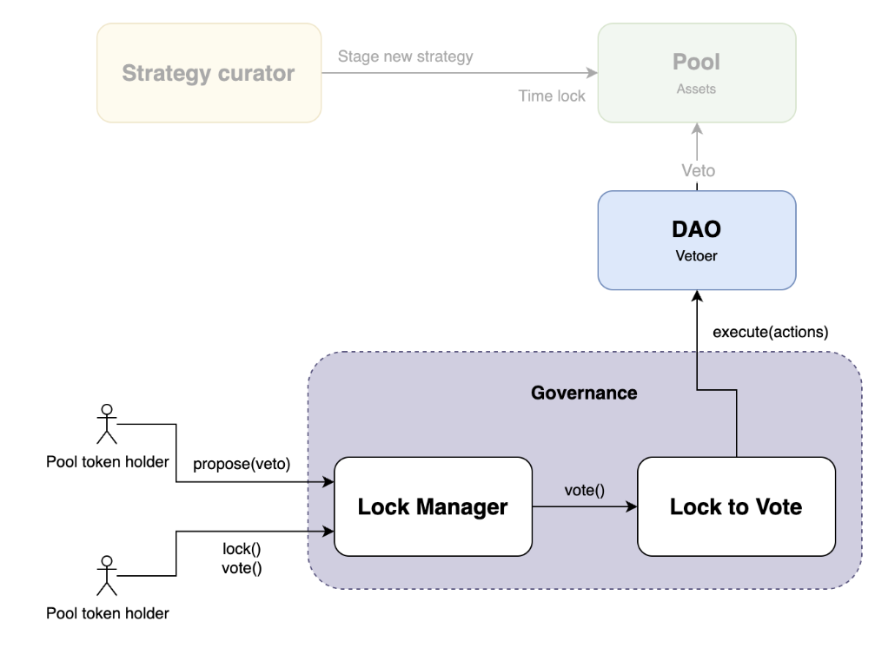

# Lock to Vote Plugin

[](https://book.getfoundry.sh/)

**An OSx governance plugin, enabling immediate voting through token locking**

Built on Aragon OSx's modular framework, LockToVote bypasses the need for *ahead of time* token snapshots via IVotes compatible tokens. **All ERC20 contracts** can now be used to participate in DAO governance.

See the [ERC20 token checklist](#erc20-token-checklist) below.

## Audit

The [source code of LockToVote](https://github.com/aragon/lock-to-vote-plugin/releases/tag/spearbit-review-end-2508) has been [audited by Spearbit](./audit/report-cantinacode-aragon-0729.pdf) between July and August 2025.

## Overview



`LockToVote` is a versatile majority voting plugin with configurable modes:

- **Multi-option voting**: Vote Yes/No/Abstain
- **Two voting modes**:
  - **Vote Replacement**: Update your vote option mid-proposal
  - **Standard Mode**: Traditional voting with append-only allocations
- **Customizable thresholds**: Minimum participation, support threshold, and a certain approval tally

## Architecture Overview

### Core Components

#### LockManager

The custodial contract managing token locks and allowing to vote in multiple proposals with a single lock

- `LockManagerBase` contains the common logic, while `LockManagerERC20` includes the specific implementation to manage ERC20 token locks.
- `lock()` deposits the available ERC20 allowance into the contract and updates the cumulative locked balance. If the balance is lower than the allowance, the whole balance is locked.
- `lock(amount)` deposits the requested ERC20 amount into the contract and updates the cumulative locked balance.
- `vote()` calls `lockToVote.vote()` with the currently locked balance on behalf of the user
- Locking and voting can be done at once with `lockAndVote()`
- To prevent unlocking with votes on active proposals, it keeps track of them via the `proposalCreated()` and `proposalSettled()` hooks

#### LockToVote

Governance plugin where successful proposals can be executed on the DAO

- Handles `IMajorityVoting.VoteOption` votes (Yes/No/Abstain)
- `vote()` allocates the current voting power into the selected voite option
- `clearVote()`: Depending on the voting mode, revoke the current allocation and trigger the corresponding tally updates
- `execute()` makes the DAO execute the given (successful) proposal's actions

### Proposal Lifecycle

```solidity
// Allow the LockManager to take our tokens
token.approve(address(lockManager), 0.1 ether);

// Lock the available tokens and vote immediately
lockManager.lockAndVote(proposalId, VoteOption.Yes);

// Or lock first, vote later
token.approve(address(lockManager), 0.5 ether);
lockManager.lock();
lockManager.vote(proposalId, VoteOption.Abstain);

// Deposit more tokens and vote with the new balance
token.approve(address(lockManager), 5 ether);
lockManager.lockAndVote(proposalId, VoteOption.No);

// Unlock your tokens (if the proposal voting modes allow it)
lockManager.unlock();
```

### Token unlocking

Users can unlock their tokens as long as `LockToVote` allows it. For this:

- Either, the plugin `votingMode` is `VoteReplacement`, or
- The token holder has no votes allocated to any active proposal

Otherwise, the `unlock()` will revert until the proposals with votes have ended.

## Prerequisites

- [Foundry](https://getfoundry.sh/)
- [just](https://github.com/casey/just)

Optional:

- [Docker](https://www.docker.com) or [Podman](https://podman.io) (recommended for deploying)

## Getting Started

Clone the repository with submodules and initialize it for a network:

```bash
git clone --recurse-submodules <repo-url>
just init          # defaults to mainnet, e.g. `just init sepolia`
```

`just init` fetches submodules, creates `.env` from `.env.example`, and selects the network. Edit `.env` to add your secrets (`DEPLOYER_KEY`, `ETHERSCAN_API_KEY`, `PINATA_JWT`, …). Alternatively — and recommended — resolve them with the [`vars`](https://github.com/vars-cli/vars) secret manager: the keys this project needs are declared in [`.vars.yaml`](./.vars.yaml), including per-network profiles (e.g. a `dev/DEPLOYER_KEY` on testnets, a real one on mainnet), and just-foundry's recipes call `vars resolve -p <network>` automatically when `vars` is installed.

Network settings (RPC URL, chain id, verifier, and the Aragon OSx addresses) come from `lib/just-foundry/networks/<network>.env` — switch with `just switch <network>`, inspect the resolved values with `just env`, and create a local editable copy with `just switch <network> override`.

### Using just

`just` is the task launcher for the project; the generic recipes are imported from [`lib/just-foundry`](https://github.com/aragon/just-foundry). Run `just` (or `just help`) to list them:

```
$ just
[setup]
init network="mainnet"       Fetch submodules, scaffold .env and select the network
switch network override=""   Select the active network
setup                        Install Foundry

[script]
predeploy                    Dry-run the deploy script (no broadcast)
deploy *args                 Run tests, then broadcast + verify
deploy-verify *args          Broadcast dummy contracts to force source verification

[metadata]
pin-metadata                 Pin the release & build metadata to IPFS

[test]
test *args                   Run unit tests (fork tests excluded)
test-fork *args              Run fork tests (requires RPC_URL)
test-coverage                Generate an HTML coverage report under ./report

[verification]
verify type="" script=""     Verify the latest broadcast (etherscan|blockscout|sourcify)

[develop]
clean                        Clean build artifacts and reports
storage-info contract        Show a contract's storage layout
check-upgrade from to        Check storage-layout upgrade compatibility

[helpers]
env                          Show the resolved environment (values + sources)
```

There are also `balance`, `refund`, `gas-price`, `nonce` and `clean-nonce` deployer helpers (run `just <name>`).

## Testing

Run the suites with `just`:

```sh
just test          # unit tests (fork tests excluded)
just test-fork     # fork tests (requires a reachable RPC_URL for the active network)
just test-coverage # HTML coverage report under ./report
```

`just test` checks the logic's accordance to the specs; `just test-fork` additionally requires `RPC_URL` (from the selected network or `.env`).

See [`TESTS.md`](./TESTS.md) for the visual test tree, and the `test/*.t.yaml` files for the source specifications.

## Deployment 🚀

Select the target network, then simulate and deploy:

```sh
just switch <network>
just predeploy     # simulate (no broadcast)
just deploy        # run tests, then broadcast + verify; logs to ./logs
```

### Deployment Checklist

When running a production deployment ceremony, you can use these steps as a reference:

- [ ] I have cloned the official repository on my computer and I have checked out the `main` branch
- [ ] I am running the ceremony inside a container from a Debian trixie image (using Docker or Podman)
  - [ ] I have run `docker run --rm -it -v .:/deployment debian:trixie-slim`
    - Or, with Podman: `podman run --rm -it -v .:/deployment:Z debian:trixie-slim`
  - [ ] I have run `apt update && apt install -y curl git just vim neovim bc`
  - On **standard EVM networks**:
    - [ ] I have run `curl -L https://foundry.paradigm.xyz | bash`
    - [ ] I have run `source /root/.bashrc`
    - [ ] I have run `foundryup`
  - On **ZkSync networks**:
    - [ ] I have run `curl -L https://raw.githubusercontent.com/matter-labs/foundry-zksync/main/install-foundry-zksync | bash`
    - [ ] I have run `source /root/.bashrc`
    - [ ] I have run `foundryup-zksync`
  - [ ] I have run `cd /deployment`
  - [ ] I have run `just init <network>`
- [ ] I am opening an editor on the `/deployment` folder, within the container
- [ ] The `.env` file (or my `vars` store) contains the correct parameters for the deployment
  - [ ] I have created a new burner wallet with `cast wallet new` and copied the private key to `DEPLOYER_KEY`
  - [ ] I have selected the correct network with `just switch <network>` (this sets RPC_URL, CHAIN_ID and the verifier)
  - [ ] I have set `ETHERSCAN_API_KEY` or `BLOCKSCOUT_HOST_NAME` (when relevant to the target network)
  - [ ] `PLUGIN_REPO_MAINTAINER_ADDRESS` is correct — defaults to the network's `MANAGEMENT_DAO_ADDRESS`; override only for a custom maintainer
  - [ ] `PLUGIN_ENS_SUBDOMAIN` is set to the desired subdomain (or left empty to skip ENS registration)
  - [ ] I have run `just env` and confirmed the resolved values (network, verifier, addresses, deployer)
  - [ ] I have run `just balance` and confirmed the deployment wallet holds enough native token for gas
  - [ ] I am the only person of the ceremony that will operate the deployment wallet
- [ ] All the tests run clean (`just test`)
- My computer:
  - [ ] Is running in a safe location and using a trusted network
  - [ ] It exposes no services or ports
    - MacOS: `sudo lsof -iTCP -sTCP:LISTEN -nP`
    - Linux: `netstat -tulpn`
    - Windows: `netstat -nao -p tcp`
  - [ ] The wifi or wired network in use does not expose any ports to a WAN
- [ ] I have run `just predeploy` and the simulation completes with no errors
- [ ] The deployment wallet has sufficient native token for gas
  - At least, 15% more than the amount estimated during the simulation
  - Re-check with `just balance`
- [ ] `just test` still runs clean
- [ ] I have run `git status` and it reports no local changes
- [ ] The current local git branch (`main`) corresponds to its counterpart on `origin`
  - [ ] I confirm that the rest of members of the ceremony pulled the last git commit on `main` and reported the same commit hash as my output for `git log -n 1`
- [ ] I have initiated the production deployment with `just deploy`

### Post deployment checklist

- [ ] The deployment process completed with no errors
- [ ] The factory contract was deployed by the deployment address
- [ ] All the project's smart contracts are correctly verified on the reference block explorer of the target network.
- [ ] The output of the latest `logs/<script>-<network>-<timestamp>.log` file corresponds to the console output
- [ ] I have transferred the remaining funds of the deployment wallet to the address that originally funded it
  - `just refund`

### ERC20 token checklist

When configuring the plugin deployment, make sure to check the implementation of your token contract.

- **Only ERC20s**: The LockManager only deals with underlying tokens of ERC-20 compatible standards. Other fungible token standards such as ERC-1155, are not supported.
- **Double-entry-point tokens**, i.e. tokens that share the same tracking of balances but have two separate contract addresses from which these balances can be controlled. They should be usable without any issue.
- **Non-reverting tokens**: ERC-20 Tokens historically handle errors in two possible ways, they either revert on errors or they simply return `false` as a result. The plugin uses SafeERC20, which ensures that non reverting tokens do revert given in case of an insufficient balance.
- **ERC20s lacking `decimals()`**: Within the ERC-20 standard, the existence of a `decimals()` function is optional. The plugin has no need for this function's existence and supports tokens without it.
- **Tokens with callbacks**: There exist various standard extensions such as ERC-223, ERC-677, ERC-777, etc., as well as custom ERC-20 compatible token implementations that call the sender, receiver, or both, during a token transfer. Furthermore, such implementations may choose to call before or after the token balances were updated. This is especially dangerous since it may allow re-entering the protocol and exploit incomplete state updates. Such tokens can be used safely.
- **Tokens with strict allowance handling**: There are tokens that revert when attempting to change an existing token allowance from a non-zero value to another non-zero value. The plugin makes no calls to the token's `approve()` function and should have no issue in using them.
- **Non-standard decimals**: Tokens typically have 18 decimals, but some deviate from this, usually towards lower numbers. The plugin supports tokens that have large deviations from the typical 18 decimals. It is only for extremely large decimal numbers (>50), combined with large transfer amounts, that there may be problems due to the `10^6` scaling used.
- **Care required for Tokens with variable supply**: The plugin relies on the Total Token Supply to be relatively stable in order to determine the total existing voting power and use it for threshold checks. Tokens that have burn and mint functionality, or other ways allowing to affect the total supply, should be integrated with care.

Not supported:

- **NOT supported: Deflationary, Inflationary or Rebasing Tokens**: There are tokens (such as Aave's aToken) which increase in balance over time, or decrease in balance over time (various algorithmic stable coins), this may cause accounting issues within smart contracts holding them. When a user adds funds to the plugin, the plugin assumes that the sum of balances stays equal to the current balance held by the plugin.
  - If the balance increases, the surplus is attributed to the LockManager. Not the original token holders.
  - If the balance decreases, those who withdraw (call `unlock()`) first will obtain their full balance, but not all users will be able to withdraw once funds have run out.
- **NOT supported: Tokens with Transfer Fees**: There are tokens which may charge a fee for transfers. This fee could be applied on the value being sent, decreasing the amount reaching the receiver, or it could be applied on the sender's remaining balance. The plugin assumes that the value specified as amount during the transfer is exactly that value that actually arrived at the plugin, unless the transfer reverts. It does currently not handle the case where the received balance deviates from the requested amount.

## Contract source verification

When running a deployment with `just deploy`, Foundry will attempt to verify the contracts on the corresponding block explorer.

If you need to verify on multiple explorers, or the automatic verification did not work, use the `verify` recipe with the desired verifier:

```sh
just verify etherscan   # or: blockscout, sourcify
just verify blockscout
just verify sourcify
```

These use the last deployment data under `broadcast/DeployNewPluginRepo.s.sol/<chain-id>/run-latest.json`.
- Ensure that the required variables are set within the `.env` file (or the active network).

If some proxies or auxiliary contracts do not appear verified after a deployment, run `just deploy-verify` to broadcast dummy instances so the explorer can index the source.

## Test specifications

Test intents are described as YAML trees under `test/*.t.yaml` and their rendered summary lives in [`TESTS.md`](./TESTS.md). These files are kept as reference documentation for the test surface — the corresponding `test/*.t.sol` implementations are the source of truth and are executed by `just test`.
